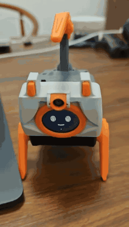

# RIG-Muse

**给 Muse 一个机器狗身体。** 基于开源 Muse Gadget SDK，原生运行在 RIG-Puppy 的 ESP32-S3 上。

[English](README.md) · [源码编译与烧录](docs/FLASHING.md) · [代码修改指南](docs/DEVELOPMENT.md) · [技术文档](esp32/README_RIG.md)

<p align="center"><a href="docs/media/puppy-greeting.mp4"></a><br><em>Muse 控制真机 Puppy 打招呼。点击查看 MP4。</em></p>

## 我们的目标

让 AI 伙伴从对话走进现实：用抬起的前爪打招呼，用表情和短音效回应互动，用摄像头分享眼前的世界。我们关注自然语言、感知与身体表达之间的连接，以及能让人开心、有回应的小互动。

Muse 负责对话和工具选择，固件负责具体硬件执行与状态反馈，不需要额外 Linux 网关。板型后端彼此独立，方便以后接入不同机器人；当前支持 Puppy，**RIG-Arm 仍待实现**。

这是 LuwuDynamics 维护的独立实验项目，基于 Meta 开源 SDK，不是 Meta 官方机器狗产品。当前实现处于实验阶段，仅提供源码，由使用者按自己的设备与网络配置后编译。

## 当前能力

| 能力 | 实现 |
|---|---|
| 动作 | 原版 16 个动作；含别名、复位及纯媒体表演，共 24 个预设条目 |
| 移动 | 前进、后退、左转、右转，有限时长与速度 |
| 表情/声音 | 动态眼睛、粒子表情、短合成音效；不播放 TTS |
| 摄像头 | 按需拍摄 240×240 JPEG，接口为 `camera.capture` |
| IMU | 空闲时对摇晃、倾斜、拿起特征用表情和音效回应 |
| 电池 | 舵机回传电压及估算电量 |
| 光剑 | 定时开关及切换模式 |
| 语音留言 | 双击 BOOT 录音，再双击发送，回复在 Muse App 查看 |
| 状态反馈 | 任务 ID、完成/失败/取消、关节反馈和停止接口 |

`rig.catalog` 返回 24 个预设、4 个移动方向、12 个板型工具；SDK 另有 `device.health`。**24 是预设数量，不是全部能力数量。** 左右指原地转向，不是横移。录音、上传和反馈流程已实现，跨网络、跨账号的语音发送仍需更多实机验证。

## 开始使用

准备 RIG-Puppy（ESP32-S3、16 MB Flash、octal PSRAM、有效原舵机标定）、USB 数据线、Muse App/账号、自己的 [SDK token](https://gadgets.muse.ai/settings/sdk-tokens)，以及能访问 Muse 的 2.4 GHz Wi-Fi。先阅读 [SDK 服务条款](https://gadgets.muse.ai/sdk-terms)。

### 1. 克隆源码并初始化构建

安装 **ESP-IDF v6.0.1**，进入该版本的开发环境：

```sh
git clone https://github.com/LuwuDynamics/RIG-Muse.git
cd RIG-Muse/esp32
. "$IDF_PATH/export.sh"
python3 -m pip install 'esptool>=5,<6' pyserial
tools/board.sh rig-puppy build
```

首次编译会下载依赖，并生成 `build-rig-puppy/sdkconfig`。项目不提供预编译下载包；所有烧录文件均由你从源码构建。具体环境安装和 Windows 使用方式见[完整指南](docs/FLASHING.md)。

### 2. 修改自己的配置

```sh
idf.py -B build-rig-puppy \
  -DSDKCONFIG=build-rig-puppy/sdkconfig menuconfig
```

在 **ESP32 Device SDK** 菜单中设置自己的 token 和可选代理，也可以直接编辑本地 `build-rig-puppy/sdkconfig`：

| 配置项 | 如何设置 |
|---|---|
| `CONFIG_GADGET_SDK_TOKEN` | 自己的 Muse SDK token；也可留空，烧录后通过 USB 输入 |
| `CONFIG_RIG_HTTP_PROXY_HOST` | 需要代理时填自己的局域网地址；默认空字符串，使用直连 |
| `CONFIG_RIG_HTTP_PROXY_PORT` | 代理软件的 HTTP/mixed 监听端口，默认 7897 |
| `CONFIG_HOMEHUB_WIFI_SSID` / `CONFIG_HOMEHUB_WIFI_PASSWORD` | 通常留空，在 Muse App 中配网 |
| `CONFIG_RIG_PARTICLE_FACE` / `CONFIG_RIG_PARTICLE_FACE_STYLE` | 粒子表情开关和重组风格 |

个人配置放在 Git 忽略的构建目录；**不要把真实 token、密码或个人代理配置写入共享源码、提交或 AI 对话**。共享板型默认值在 `esp32/devices/sdkconfig.rig-puppy`，可配置项在 `esp32/main/Kconfig.projbuild`。已有构建以生成的 `sdkconfig` 为准，修改默认值后不会自动覆盖个人配置。

### 3. 重新编译、检查并烧录

```sh
tools/board.sh rig-puppy build
tools/rig_host_tests.sh
python3 tools/prepare_flash.py
python3 build-rig-puppy/flash-rig/flash.py --port YOUR_PUPPY_PORT
```

把 `YOUR_PUPPY_PORT` 换成当前 Puppy 的 USB UART 端口，例如 macOS `/dev/cu.usbmodem...`、Linux `/dev/ttyACM0` 或 Windows `COM5`。控制台 115200 baud，烧录默认 230400 baud。

工具使用你刚编译的文件，检查布局、文件校验值，并核对烧录前后的原始标定扇区；不执行动作。首次安装会替换原固件和分区表，若需恢复，事先私下保存原设备完整备份。仅适用于 Puppy，不能烧到 Arm。个人编译文件可能包含凭据，不要上传。

### 4. 配对 Muse

若编译时 token 留空，用本地 USB 隐藏输入，不回显也不进入命令行参数：

```sh
python3 tools/provision_rig.py --port YOUR_PUPPY_PORT --sdk-token
```

在 Muse App 打开 **Settings → Devices → Developer mode**，添加 `MuseGadget-RIG-XXXXXX`，配上 2.4 GHz Wi-Fi，并在提示时按 BOOT 确认。连接后，让 Muse 查看 `rig.catalog` 和 `rig.status`；小狗放在平整、空旷地面上再测试动作。

## 代理如何配置

**源码默认直连，不包含作者的网络配置。** 如有需要，在上述本地配置中填写代理地址和端口后重新编译；也可在烧录后通过 USB 设置设备级覆盖值：

```sh
python3 tools/provision_rig.py --port YOUR_PUPPY_PORT --proxy YOUR_LAN_PROXY_HOST:7897
# 显式关闭代理，覆盖编译时设置：
python3 tools/provision_rig.py --port YOUR_PUPPY_PORT --direct
```

已保存的 USB 配置优先于编译配置，重启后生效；重新烧录会保留它。`--clear` 删除 USB 覆盖值，重启后回到编译时默认值。普通 BOOT 配网重置不清除这些 USB 设置。

若代理运行在 Mac/PC 上，电脑需保持运行、代理需允许局域网访问，并放行监听端口。小狗必须能访问代理主机，通常连接同一局域网。`127.0.0.1` 指的是小狗自己。

采用 HTTP CONNECT，保留目标 TLS 证书校验；不支持 SOCKS5、代理认证、UDP 或全设备 VPN。代理连接失败不会自动绕过代理直连。手机有 VPN，不代表热点客户端自动走 VPN。

## 可以怎么玩

- “小狗，跟大家打个招呼。”：招手、表情和音效。
- “用小狗的相机拍一张。”：通过 `camera.capture` 获取机器人视角。
- “往前走一小步，然后停下。”：短时前进，结束回到站姿。
- “现在电压多少？”：读取 `rig.battery`。
- 空闲且已连接时，双击 BOOT 录音，再双击发送。录音时单击取消，运动时按键优先停止。

动作返回 `accepted` 只表示接收任务，应继续检查 `rig.status` 到完成、失败或取消。完成依据关节反馈和时间线，不代表导航目标或移动距离已经达到。

## 使用 AI 编码助手开发

建议使用 **Codex、Claude Code 或其他具备仓库上下文能力的编码助手**，协助准备环境、理解代码、修改功能和执行验证。项目已准备以下资料：

- [AGENTS.md](AGENTS.md)：编码助手的项目入口，包含架构、构建命令、验证标准和设备操作约定。
- [CLAUDE.md](CLAUDE.md)：Claude Code 入口，引用同一套项目说明。
- [代码修改指南](docs/DEVELOPMENT.md)：常见需求应修改的文件、能力扩展位置和任务示例。
- [ESP32 SDK 说明](esp32/AGENTS.md)：上游 SDK 的详细开发流程。

在仓库目录打开编码助手，可以这样描述任务：

> 请先阅读 AGENTS.md 和 docs/FLASHING.md，检查 ESP-IDF 6.0.1 环境，从源码编译 RIG-Puppy，并指导我在本地配置 token 和可选代理，不要读取或输出凭据。先报告构建与测试结果，烧录前核对目标设备。

修改功能时，可以继续让助手检查相关板型后端、实现行为、执行测试，并说明哪些项目仍需真机验收。配置值由你在本地输入，不需要把 token 发给助手。

## 后续方向与贡献

更丰富的连续互动、更广泛的语音留言验证、可复现的真机检查流程，以及独立 RIG-Arm 后端。上电不主动执行动作；原标定只读；同一时间只执行一个身体任务。扭矩仅作遥测，不作为软件过载保护。贡献方式见 [CONTRIBUTING.md](CONTRIBUTING.md)，隐私说明见 [SECURITY.md](SECURITY.md)。

## 来源与许可

基于 [facebookincubator/muse-gadget-sdk](https://github.com/facebookincubator/muse-gadget-sdk)，基线提交 `693cde9a884ad1edc87251b9f8944815f8de4809`。动作公式与硬件定义参考 Luwu RIG-Omni。保留上游 Apache-2.0 许可及版权说明；第三方文件和 Jollybot 素材保留原许可范围，见 [THIRD_PARTY.md](docs/THIRD_PARTY.md)、[NOTICE](NOTICE) 和 [上游 README](README.upstream.md)。Muse 服务使用和 SDK token 另受 SDK 服务条款约束。
